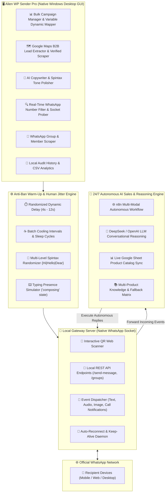

# 🛸 Alien WP Sender Pro — Enterprise WhatsApp Automation & Marketing Suite

  

  
  
  

  
  
  
  

---

## 🌟 Executive Overview

**Alien WP Sender Pro** is a high-performance, enterprise-grade desktop automation solution designed for high-throughput WhatsApp marketing, lead generation, and 24/7 autonomous customer engagement. 

Engineered with a **100% self-contained offline architecture**, the software runs immediately on any fresh Windows computer without requiring .NET runtimes, external dependencies, or complex server environments.

---

## 🏗️ Enterprise System Architecture

---

## 📊 Feature Comparison Matrix

| Feature / Capability | Standard WhatsApp Senders | Alien WP Sender Pro Enterprise |
| :--- | :---: | :---: |
| **Engine Core** | Browser Automation (Slow/Resource Heavy) | Native High-Speed Socket Protocol |
| **Anti-Ban Protection** | Fixed Static Delays | Dynamic Human Jitter + Typing State Simulation |
| **B2B Lead Extractor** | ❌ Requires Separate Paid Tool | ✅ Integrated Google Maps Scraper with Phone/Email |
| **24/7 Multi-Modal AI Agent** | ❌ Keyword Match Only | ✅ Multi-Modal AI (Text, Voice, Images, Calls) |
| **Live Google Sheet Sync** | ❌ Not Supported | ✅ Dynamic Live Product & Price Ingestion |
| **Multi-Media Attachments** | Single File per message | ✅ Unlimited Images, Videos, PDFs, Docs, Audio |
| **WhatsApp Number Verifier** | ❌ Paid 3rd-party API | ✅ Built-in Real-Time Socket Prober |
| **Offline Portability** | ❌ Requires Node/.NET Setup | ✅ 100% Self-Contained Standalone Distribution |
| **Monthly Subscription Fees** | ❌ $30 – $100 / month | ✅ Zero Monthly Fees (Lifetime License) |

---

## 🌟 Core Capabilities & Visual Highlights

### 1. 💬 High-Speed Bulk Campaign Dispatcher & Anti-Ban Engine
- **Dynamic Human Jitter**: Sends each message with randomized delay intervals (e.g. 4s – 12s) to mimic real human behavior.
- **Batch Cooling Cycles**: Automatically pauses sending after a configurable number of messages to prevent account bans.
- **Typing State Simulation**: Broadcasts `'composing'` status to WhatsApp before message delivery.
- **Dynamic Tags & Spintax**: Supports dynamic merge tags (`{{Name}}`, `{{Company}}`, `{{InvoiceNo}}`) and nested Spintax (`{Hi|Hello|Dear} {Name}`).

---

### 2. 🗺️ Integrated Google Maps B2B Lead Extractor
- Search targeted keywords (e.g. *Real Estate Agencies in Dhaka*, *Pharmacies in Dubai*, *Restaurants in London*).
- Extracts business names, verified telephone numbers, emails, addresses, rating, and website URLs.
- **1-Click Export**: Export directly to CSV/Excel or load straight into active broadcast campaigns.

  

---

### 3. 🤖 24/7 Multi-Modal Autonomous AI Sales & Support Agent
- **Universal Modality Ingestion**:
  - 💬 **Text Messages**: Answers inquiries, quotes live pricing, handles objections, and closes sales.
  - 🎙️ **Voice Notes & Audio**: Automated audio recognition and instant contextual text reply.
  - 📷 **Images & Screenshots**: Analyzes customer screenshots, payment receipts, and error dialogs.
  - 📞 **Incoming WhatsApp Calls**: Automatically detects voice/video calls and immediately sends follow-up messages with catalogs and hotline numbers.
- **Live Google Sheets Integration**: Syncs real-time inventory, pricing, and product specifications without restarting workflows.

  

---

### 4. 🏢 Enterprise Companion Systems & Modules
- **ZKTeco Biometric Attendance Hub**: Push ADMS cloud integration with automated WhatsApp late/absent notifications.
- **Multi-Store POS & Inventory**: Retail billing, thermal printing, and multi-branch inventory tracking.
- **SMS & OTP Broadcaster**: Transactional OTP gateway supporting GP, Robi, Banglalink, Teletalk, and global Twilio channels.

---

## 📥 Official Distribution & Downloads

Download the latest verified release directly from our [**GitHub Releases**](https://github.com/sohaghaing0070/Alien-WP-Sender-Pro/releases/tag/v2.5.0):

| Package Name | File Format | File Size | Setup Type | Direct Download Link |
| :--- | :---: | :---: | :---: | :--- |
| **Alien WP Sender Pro Setup Wizard** | `.exe` | ~300 MB | Single-File Windows Installer | [📥 Download Setup Wizard](https://github.com/sohaghaing0070/Alien-WP-Sender-Pro/releases/download/v2.5.0/Alien_WP_Sender_Pro_v2.5.0_Setup.exe) |
| **Alien WP Sender Pro Portable Edition** | `.zip` | ~117 MB | Zero-Install Portable Archive | [📥 Download Portable ZIP](https://github.com/sohaghaing0070/Alien-WP-Sender-Pro/releases/download/v2.5.0/Alien_WP_Sender_Pro_v2.5.0_Portable.zip) |

> [!IMPORTANT]
> **100% Self-Contained Offline Architecture:** Both distribution packages bundle all required runtimes (.NET 7 Win-x64, Node.js WhatsApp Engine, and Assets). **No manual prerequisites or external SDKs need to be installed on target computers.**

---

## 💻 System Specifications

- **Operating System:** Windows 10, Windows 11, Windows Server 2016 / 2019 / 2022 (64-bit)
- **Processor:** Dual-Core 2.0 GHz or higher (Intel / AMD)
- **Memory (RAM):** 4 GB RAM minimum (8 GB recommended for heavy scraping)
- **Storage Space:** 600 MB free hard disk space
- **Connectivity:** Standard Internet connection for WhatsApp socket communication

---

## 📦 Transparent Commercial Licensing & Pricing

| License Package | Price (BDT) | Price (USD) | Scope & Inclusions |
| :--- | :---: | :---: | :--- |
| **Lifetime License** *(Software Only)* | **10,000 BDT** | **$90 USD** | Unlimited Bulk WhatsApp Sender + Google Maps Scraper + Real-Time Number Verifier + Free Lifetime Updates + VIP Priority Support + Full Local REST API Access |
| **n8n AI Workflow Setup** *(Add-on / Service)* | **5,000 BDT** | **$45 USD** | Complete n8n Multi-Modal AI Auto-Reply Bot Configuration + DeepSeek LLM Integration + Google Sheets Live Catalog Sync + Server Deployment & Webhook Binding |
| **Complete Enterprise Bundle** *(Best Value)* | **15,000 BDT** | **$135 USD** | **Lifetime Software License + Full n8n AI Setup & Turnkey Deployment** + Dedicated 1-on-1 Onboarding & Custom Prompt Engineering |

👉 **[View Live Google Sheets Catalog & Feature Breakdown](https://docs.google.com/spreadsheets/d/1l_LpDLf68Esvvl2LNlL3-wf3pviJd00aOVVTeZpoJ1E/edit?usp=sharing)**

---

## 📞 24/7 Enterprise Sales & Technical Support

- **🌐 Official Website:** [https://aliensoftwaredevelopment.com](https://aliensoftwaredevelopment.com)
- **📱 Direct Hotline / WhatsApp:** **`+8801710978997`** (👉 [Click to Chat on WhatsApp](https://wa.me/8801710978997))
- **💻 Instant Live Demo:** Available daily via AnyDesk / TeamViewer.
- **💳 Accepted Payment Methods:** bKash (Personal/Merchant), Nagad, Rocket, Bank Wire Transfer, Visa / Mastercard, and USDT (Crypto TRC-20).

---

**Developed with ❤️ by [Alien Software Development](https://aliensoftwaredevelopment.com)**  
*Transforming Businesses with Intelligent Software & Enterprise Automation.*

