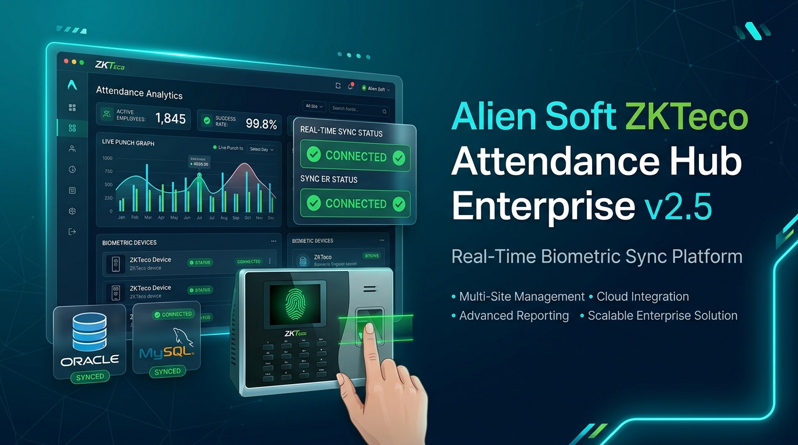
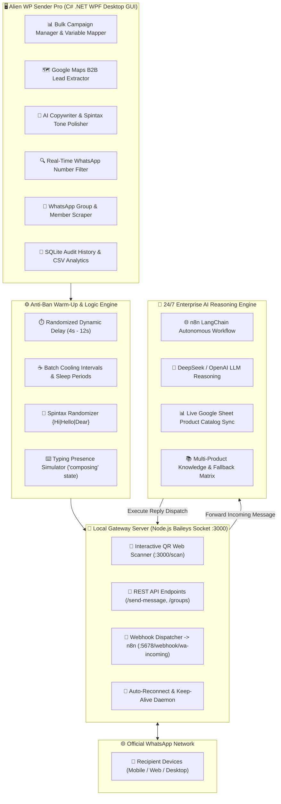
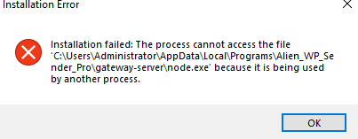
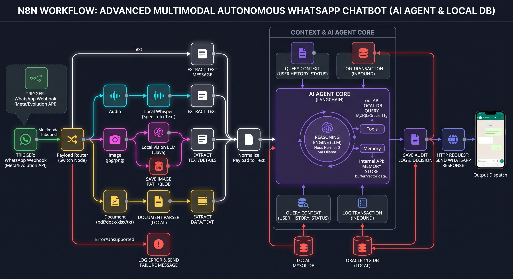

<div align="center">

# 🛸 Alien WP Sender Pro Enterprise
### **Next-Generation Bulk WhatsApp Marketing, B2B Lead Extraction & AI Auto-Reply Platform**

[](https://github.com/sohaghaing0070/Alien-WP-Sender-Pro/releases/tag/v2.5.0)
[](https://github.com/sohaghaing0070/Alien-WP-Sender-Pro)
[](https://github.com/sohaghaing0070/Alien-WP-Sender-Pro)
[](https://github.com/sohaghaing0070/Alien-WP-Sender-Pro)
[](https://github.com/sohaghaing0070/Alien-WP-Sender-Pro)

<br/>



<br/><br/>

**Alien WP Sender Pro Enterprise** is a carrier-grade Windows desktop application and resilient background gateway service engineered for high-speed WhatsApp marketing, automated B2B lead scraping, intelligent AI auto-replying, dynamic Spintax personalization, and REST API integration with zero recurring monthly charges.

<br/>

[📥 Download Installer (.exe)](https://github.com/sohaghaing0070/Alien-WP-Sender-Pro/releases/download/v2.5.0/Alien_WP_Sender_Pro_v2.5.0_Setup.exe) • [📦 Download Portable (.zip)](https://github.com/sohaghaing0070/Alien-WP-Sender-Pro/releases/download/v2.5.0/Alien_WP_Sender_Pro_v2.5.0_Portable.zip) • [💬 WhatsApp Sales & Support](https://wa.me/8801710978997) • [🌐 Official Website](https://aliensoftware.dev) • [📊 Live Product Catalog](https://docs.google.com/spreadsheets/d/1l_LpDLf68Esvvl2LNlL3-wf3pviJd00aOVVTeZpoJ1E/edit?usp=sharing)

---

</div>

## 📑 Table of Contents
- [Executive Overview](#-executive-overview)
- [System Architecture](#-system-architecture)
- [Feature Matrix: Standard Senders vs Alien WP Sender Pro](#-feature-matrix-standard-senders-vs-alien-wp-sender-pro)
- [Core Capabilities & Engineering Highlights](#-core-capabilities--engineering-highlights)
  - [1. Smart Anti-Ban Warm-up & Human Behavior Engine](#1-smart-anti-ban-warm-up--human-behavior-engine)
  - [2. Built-in Google Maps B2B Lead Extractor](#2-built-in-google-maps-b2b-lead-extractor)
  - [3. 24/7 Autonomous AI Auto-Reply & Sales Agent (DeepSeek + n8n)](#3-247-autonomous-ai-auto-reply--sales-agent-deepseek--n8n)
  - [4. Multi-Media Attachments Sequencer](#4-multi-media-attachments-sequencer)
  - [5. Dynamic Column Tagging & Spintax Personalization](#5-dynamic-column-tagging--spintax-personalization)
  - [6. Real-Time Number Verifier & Filter](#6-real-time-number-verifier--filter)
  - [7. Group Extractor & Community Scraper](#7-group-extractor--community-scraper)
  - [8. Silent Gateway Server & Developer REST API](#8-silent-gateway-server--developer-rest-api)
- [REST API Specifications & Endpoints](#-rest-api-specifications--endpoints)
- [n8n Workflow Automation Blueprint](#-n8n-workflow-automation-blueprint)
- [Deployment & Installation Guide](#-deployment--installation-guide)
- [Official Pricing & License Packages](#-official-pricing--license-packages)
- [Developer & Enterprise Support](#-developer--enterprise-support)

---

## 🎯 Executive Overview

Bulk WhatsApp messaging operations often face severe hurdles:
- **Account bans and number flagging** due to repetitive text patterns and non-human sending rates.
- **Scattered tooling** requiring separate software for lead scraping, message sending, AI auto-replies, and phone number validation.
- **Exorbitant monthly subscription fees** from SaaS providers that impose strict template approval barriers and volume limits.

**Alien WP Sender Pro Enterprise** delivers an all-in-one on-premises marketing platform that eliminates account risk through dynamic human simulation, extracts high-value B2B leads on demand, and autonomously handles incoming client inquiries 24/7 using local AI and n8n workflow integration.

---

## 🏗️ System Architecture



---

## 📊 Feature Matrix: Standard Senders vs Alien WP Sender Pro

| Feature / Capability | Standard WhatsApp Senders | Alien WP Sender Pro Enterprise |
| :--- | :---: | :---: |
| **Sending Speed & Engine** | Browser Automation (Slow/Laggy) | Native Lightweight Baileys Socket (Ultra-Fast) |
| **Anti-Ban Protection** | Fixed Static Delays | Dynamic Human Jitter + Typing State Simulation |
| **Google Maps Lead Extractor** | ❌ Requires Separate Tool | ✅ Integrated B2B Google Maps Scraper |
| **24/7 AI Auto-Reply Bot** | ❌ Keyword Match Only | ✅ DeepSeek LLM + n8n Multi-Turn Reasoning |
| **Live Google Sheet Sync** | ❌ Not Supported | ✅ Dynamic Live Product & Price Ingestion |
| **Multi-Media Attachments** | 1 File per message | ✅ Unlimited Images, Videos, PDFs, Docs, Audio |
| **WhatsApp Number Verifier** | ❌ Paid 3rd-party API | ✅ Built-in Real-Time Socket Prober |
| **Developer REST API & Webhooks** | ❌ Closed / Locked | ✅ Full Local REST API & Webhooks Included |
| **Monthly Subscription Fees** | ❌ $30 – $100 / month | ✅ Zero Monthly Fees (1-Yr / Lifetime License) |

---

## 🌟 Core Capabilities & Engineering Highlights

### 1. Smart Anti-Ban Warm-up & Human Behavior Engine
- **Dynamic Human Jitter**: Sends each message with randomized delay intervals (e.g. 4s – 12s) to mimic real human behavior.
- **Batch Cooling Cycles**: Automatically pauses sending after a configurable number of messages (e.g. 60s pause after every 25 messages) to avoid spam detection.
- **Typing Indicator Simulation**: Broadcasts `'composing'` status to WhatsApp before sending text.

### 2. Built-in Google Maps B2B Lead Extractor
- Search targeted keywords (e.g. *Real Estate Agencies in Dhaka*, *Pharmacies in Dubai*, *Restaurants in London*).
- Extracts business names, verified telephone numbers, emails, addresses, rating, and website URLs.
- 1-Click export directly into the Bulk Campaign Sender.

<p align="center">
  
</p>

### 3. 24/7 Autonomous AI Auto-Reply & Sales Agent (DeepSeek + n8n)
- Powered by DeepSeek / OpenAI LLMs integrated with n8n workflow `WFAlienWP001AI`.
- Multi-turn conversation memory with support for text, images, and PDF documents.
- Automatically quotes pricing, provides product specs, and directs clients to hotline `+8801710978997`.

<p align="center">
  
</p>

### 4. Multi-Media Attachments Sequencer
- Send Images (`.jpg`, `.png`, `.webp`), Videos (`.mp4`), Documents (`.pdf`, `.docx`, `.xlsx`), and Voice Notes (`.mp3`, `.ogg`).
- Custom captions per attachment with full Spintax support.

### 5. Dynamic Column Tagging & Spintax Personalization
- Import `.csv`, `.xlsx`, `.txt`, `.vcf` files with unlimited custom columns.
- Personalize messages with dynamic tags: `{{Name}}`, `{{Company}}`, `{{InvoiceNo}}`, `{{DueDate}}`.
- Nested Spintax support: `{Hi|Hello|Dear} {Name}, {special offer|exclusive discount} for you!`.

---

## 📡 REST API Specifications & Endpoints

Alien WP Sender Pro includes a built-in REST API running on port `3000`:

### 1. Send Single / Bulk Message
```http
POST http://localhost:3000/send-message
Content-Type: application/json

{
  "number": "8801710978997",
  "message": "Hello from Alien WP Sender Pro! 🚀",
  "mediaPaths": [
    "C:\\Users\\User\\Documents\\brochure.pdf",
    "C:\\Users\\User\\Pictures\\product.jpg"
  ]
}
```

### 2. Verify Real WhatsApp Numbers
```http
POST http://localhost:3000/check-whatsapp-numbers
Content-Type: application/json

{
  "numbers": ["8801710978997", "8801970978997", "8801500000000"]
}
```

### 3. Fetch Participating WhatsApp Groups & Members
```http
GET http://localhost:3000/groups
GET http://localhost:3000/group-participants?groupId=120363045678901234@g.us
```

### 4. Connection Health Check & Live Status
```http
GET http://localhost:3000/status
```

---

## 📦 Official Pricing & License Packages

| License Tier | Price (BDT) | Price (USD) | Features Included |
| :--- | :---: | :---: | :--- |
| **1-Year License** | **1,500 BDT** | **$20 USD** | Unlimited Bulk WhatsApp Sender + Google Maps Scraper + Standard Updates |
| **Lifetime License** *(Best Value)* | **3,500 BDT** | **$45 USD** | Unlimited Marketing + Free Lifetime Updates + VIP Priority Support + Full API Access |

💳 **Accepted Payment Methods:** bKash (Personal/Merchant), Nagad, Rocket, Bank Transfer, Visa/Mastercard, USDT/Crypto.

---

## 🚀 Deployment & Installation Guide

1. **Download Setup**: Download [`Alien_WP_Sender_Pro_v2.5.0_Setup.exe`](https://github.com/sohaghaing0070/Alien-WP-Sender-Pro/releases/download/v2.5.0/Alien_WP_Sender_Pro_v2.5.0_Setup.exe).
2. **Run Installer**: Follow the setup wizard to install the software on Windows 10/11.
3. **Link WhatsApp**: Open the application, navigate to **Settings & QR Scanner**, and scan the QR code with your phone.
4. **Start Campaign**: Import your contacts CSV, type your message, and click **Start Campaign**!

---

## 📞 Developer & Enterprise Support

- 📱 **Hotline / WhatsApp Sales & Support:** [+8801710978997](https://wa.me/8801710978997)
- 🌐 **Official Website:** [https://aliensoftware.dev](https://aliensoftware.dev)
- 🐙 **GitHub Repository:** [https://github.com/sohaghaing0070/Alien-WP-Sender-Pro](https://github.com/sohaghaing0070/Alien-WP-Sender-Pro)
- ⏰ **Support Hours:** 09:00 AM – 09:00 PM (Daily)
- 🛠️ **Remote Assistance:** Instant setup and live demo via AnyDesk / TeamViewer.

<br/>

<div align="center">

**Developed with ❤️ by [Alien Software Development](https://aliensoftware.dev)**  
*Transforming Businesses with Intelligent Software & Automation.*

</div>
